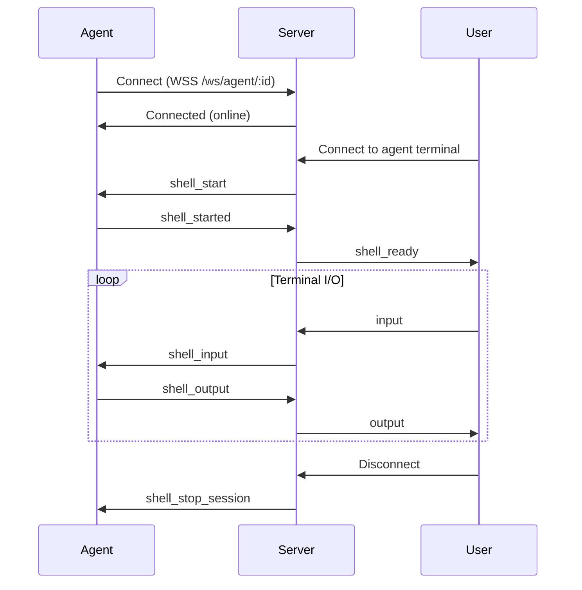

## Endpoints

### Container Terminal

```
WSS /ws/terminal/:containerId
```

Establish a WebSocket connection to a container's terminal.

<ParamField path="containerId" type="string" required>
  Container ID (Docker ID, DB UUID, or terminal name)
</ParamField>

<ParamField query="id" type="string">
  Connection identifier for multiplexing (default: `"default"`)
  
  Use unique IDs for each browser tab/pane to support multiple simultaneous connections
</ParamField>

<ParamField query="newSession" type="boolean" default={false}>
  Create new independent shell session
  
  - `true`: Creates new tmux session `split-<timestamp>`
  - `false`: Attaches to main tmux session for persistence
</ParamField>

<ParamField query="token" type="string">
  Authentication token (alternative to Authorization header)
</ParamField>

#### Authentication

<CodeGroup>

```bash cURL (Auth Header)
curl -i -N \
  -H "Connection: Upgrade" \
  -H "Upgrade: websocket" \
  -H "Sec-WebSocket-Version: 13" \
  -H "Sec-WebSocket-Key: x3JJHMbDL1EzLkh9GBhXDw==" \
  -H "Sec-WebSocket-Protocol: rexec.v1" \
  -H "Authorization: Bearer YOUR_JWT_TOKEN" \
  "https://api.rexec.io/ws/terminal/abc123"
```

```javascript JavaScript/TypeScript
const ws = new WebSocket(
  'wss://api.rexec.io/ws/terminal/abc123?id=main',
  ['rexec.v1', `rexec.token.${token}`]
);

ws.onopen = () => {
  // Send initial resize
  ws.send(JSON.stringify({
    type: 'resize',
    cols: 80,
    rows: 24
  }));
};

ws.onmessage = (event) => {
  const msg = JSON.parse(event.data);
  switch (msg.type) {
    case 'connected':
      console.log('Terminal connected');
      break;
    case 'output':
      terminal.write(msg.data);
      break;
    case 'stats':
      updateStats(JSON.parse(msg.data));
      break;
  }
};
```

```python Python
import asyncio
import websockets
import json

async def connect_terminal(container_id, token):
    uri = f"wss://api.rexec.io/ws/terminal/{container_id}?id=main"
    headers = {"Authorization": f"Bearer {token}"}
    
    async with websockets.connect(uri, extra_headers=headers) as ws:
        # Send initial resize
        await ws.send(json.dumps({
            "type": "resize",
            "cols": 80,
            "rows": 24
        }))
        
        # Read messages
        async for message in ws:
            msg = json.loads(message)
            if msg["type"] == "output":
                print(msg["data"], end="")
            elif msg["type"] == "stats":
                stats = json.loads(msg["data"])
                print(f"CPU: {stats['cpu_percent']}%")

await connect_terminal("abc123", "your-token")
```

```go Go
package main

import (
	"encoding/json"
	"log"
	"net/url"

	"github.com/gorilla/websocket"
)

func connectTerminal(containerID, token string) {
	u := url.URL{
		Scheme: "wss",
		Host:   "api.rexec.io",
		Path:   "/ws/terminal/" + containerID,
	}
	q := u.Query()
	q.Set("id", "main")
	u.RawQuery = q.Encode()

	headers := map[string][]string{
		"Authorization": {"Bearer " + token},
	}

	c, _, err := websocket.DefaultDialer.Dial(u.String(), headers)
	if err != nil {
		log.Fatal(err)
	}
	defer c.Close()

	// Send initial resize
	resize := map[string]interface{}{
		"type": "resize",
		"cols": 80,
		"rows": 24,
	}
	c.WriteJSON(resize)

	// Read messages
	for {
		var msg map[string]interface{}
		err := c.ReadJSON(&msg)
		if err != nil {
			log.Println("read:", err)
			return
		}

		switch msg["type"] {
		case "output":
			log.Print(msg["data"])
		case "stats":
			log.Printf("Stats: %v", msg["data"])
		}
	}
}
```

</CodeGroup>

#### Response States

<ResponseField name="connected" type="status">
  Connection established successfully
  
  ```json
  {
    "type": "connected",
    "data": "Terminal session established"
  }
  ```
</ResponseField>

<ResponseField name="shell_starting" type="status">
  Shell initialization in progress
  
  ```json
  {
    "type": "shell_starting",
    "data": "Starting shell..."
  }
  ```
</ResponseField>

<ResponseField name="shell_ready" type="status">
  Shell ready for input
  
  ```json
  {
    "type": "shell_ready",
    "data": "Shell ready"
  }
  ```
</ResponseField>

#### Error Responses

<ResponseField name="401" type="error">
  Unauthorized - Invalid or missing token
  
  ```json
  {
    "error": "unauthorized"
  }
  ```
</ResponseField>

<ResponseField name="403" type="error">
  Forbidden - User doesn't own container or lacks collab access
  
  ```json
  {
    "error": "access denied"
  }
  ```
</ResponseField>

<ResponseField name="404" type="error">
  Container not found
  
  ```json
  {
    "error": "container not found",
    "code": "container_not_found",
    "hint": "Container may need to be recreated. Try starting it.",
    "action_required": "start"
  }
  ```
</ResponseField>

<ResponseField name="423" type="error">
  Terminal is MFA locked
  
  ```json
  {
    "error": "terminal is MFA protected",
    "code": "mfa_required",
    "container_id": "abc123",
    "hint": "This terminal is protected with MFA. Enter your authenticator code to access it.",
    "action_required": "mfa_verify"
  }
  ```
</ResponseField>

---

### Agent Terminal

```
WSS /ws/agent/:agentId
```

Connect to a remote agent terminal. Agents are external servers connected to Rexec.

<ParamField path="agentId" type="string" required>
  Agent ID (from agent registration)
</ParamField>

<ParamField query="id" type="string">
  Connection identifier for multiplexing
</ParamField>

<ParamField query="newSession" type="boolean" default={false}>
  Create new independent shell session on the agent
  
  - `true`: Creates session `split-<connectionId>`
  - `false`: Uses main session for persistence
</ParamField>

#### Agent Connection Flow



#### Agent WebSocket Messages

**Server → Agent**

<ResponseField name="shell_start" type="message">
  Start a new shell session
  
  ```json
  {
    "type": "shell_start",
    "data": {
      "session_id": "main",
      "new_session": false
    }
  }
  ```
  
  <ParamField body="session_id" type="string" required>
    Session identifier: `"main"` for primary session or `"split-<id>"` for split panes
  </ParamField>
  
  <ParamField body="new_session" type="boolean">
    Whether to create a new independent session
  </ParamField>
</ResponseField>

<ResponseField name="shell_input" type="message">
  User keyboard input
  
  ```json
  {
    "type": "shell_input",
    "data": {
      "session_id": "main",
      "data": [108, 115, 13]
    }
  }
  ```
  
  <ParamField body="data" type="byte[]" required>
    Raw input bytes (UTF-8 encoded)
  </ParamField>
</ResponseField>

<ResponseField name="shell_resize" type="message">
  Terminal size changed
  
  ```json
  {
    "type": "shell_resize",
    "data": {
      "session_id": "main",
      "cols": 120,
      "rows": 30
    }
  }
  ```
</ResponseField>

<ResponseField name="shell_stop" type="message">
  Stop all shell sessions
  
  ```json
  {
    "type": "shell_stop"
  }
  ```
</ResponseField>

<ResponseField name="shell_stop_session" type="message">
  Stop specific shell session
  
  ```json
  {
    "type": "shell_stop_session",
    "data": {
      "session_id": "split-abc123"
    }
  }
  ```
</ResponseField>

<ResponseField name="ping" type="message">
  Keep-alive ping
  
  ```json
  {
    "type": "ping"
  }
  ```
  
  Agent must respond with `pong`
</ResponseField>

<ResponseField name="exec" type="message">
  Execute a command (non-interactive)
  
  ```json
  {
    "type": "exec",
    "data": {
      "command": "ls -la"
    }
  }
  ```
</ResponseField>

**Agent → Server**

<ResponseField name="shell_started" type="message">
  Shell session started successfully
  
  ```json
  {
    "type": "shell_started",
    "data": {
      "session_id": "main"
    }
  }
  ```
</ResponseField>

<ResponseField name="shell_output" type="message">
  Shell output data
  
  ```json
  {
    "type": "shell_output",
    "data": {
      "session_id": "main",
      "data": [27, 91, 51, 50, 109, 117, 115, 101, 114]
    }
  }
  ```
  
  Output is raw bytes including ANSI escape codes
</ResponseField>

<ResponseField name="shell_stopped" type="message">
  Shell session stopped
  
  ```json
  {
    "type": "shell_stopped",
    "data": {
      "session_id": "main",
      "exit_code": 0
    }
  }
  ```
</ResponseField>

<ResponseField name="shell_error" type="message">
  Shell error occurred
  
  ```json
  {
    "type": "shell_error",
    "data": {
      "session_id": "main",
      "error": "Failed to spawn shell: command not found"
    }
  }
  ```
</ResponseField>

<ResponseField name="pong" type="message">
  Response to ping
  
  ```json
  {
    "type": "pong"
  }
  ```
</ResponseField>

<ResponseField name="exec_result" type="message">
  Command execution result
  
  ```json
  {
    "type": "exec_result",
    "data": {
      "stdout": "file1\nfile2\n",
      "stderr": "",
      "exit_code": 0
    }
  }
  ```
</ResponseField>

<ResponseField name="system_info" type="message">
  Agent system information (sent on connect)
  
  ```json
  {
    "type": "system_info",
    "data": {
      "hostname": "prod-server-1",
      "os": "linux",
      "arch": "amd64",
      "num_cpu": 8,
      "memory": {
        "total": 17179869184,
        "available": 8589934592
      },
      "disk": {
        "total": 107374182400,
        "free": 53687091200
      }
    }
  }
  ```
</ResponseField>

<ResponseField name="stats" type="message">
  Real-time resource statistics (periodic)
  
  ```json
  {
    "type": "stats",
    "data": {
      "cpu_percent": 15.2,
      "memory_usage": 8589934592,
      "memory_limit": 17179869184,
      "memory_percent": 50.0,
      "disk_usage": 53687091200,
      "disk_limit": 107374182400,
      "network_rx_bytes": 1024000,
      "network_tx_bytes": 512000
    }
  }
  ```
</ResponseField>

## Session Management

### Multiplexing Support

Support for multiple terminal panes per container/agent:

<CodeGroup>

```javascript Main Terminal
// Main terminal - uses persistent "main" session
const mainWs = new WebSocket(
  'wss://api.rexec.io/ws/terminal/abc123?id=main'
);
```

```javascript Split Pane 1
// Split pane - independent session
const split1Ws = new WebSocket(
  'wss://api.rexec.io/ws/terminal/abc123?id=split1&newSession=true'
);
```

```javascript Split Pane 2
// Another split pane - separate session
const split2Ws = new WebSocket(
  'wss://api.rexec.io/ws/terminal/abc123?id=split2&newSession=true'
);
```

</CodeGroup>

### Session Lifecycle

<Note>
  **Main Session**: Persists across reconnections using tmux
  - Session name: `main`
  - Survives disconnections and server restarts
  - Automatically resumed on reconnect
</Note>

<Warning>
  **Split Sessions**: Temporary and cleaned up on disconnect
  - Session name: `split-<timestamp>` or `split-<connectionId>`
  - Terminated when connection closes
  - Useful for temporary panes and one-off commands
</Warning>

### Auto-restart Behavior

Containers automatically restart the shell if it exits:

```bash
# User types 'exit'
exit

# Server detects exit and shows:
[Shell exited. Starting new session...]

# New shell starts automatically
user@container:~$ 
```

- **Max Restarts**: 10 (prevents infinite loops)
- **Restart Counter**: Resets after 1 minute of stable operation
- **macOS VMs**: Only 3 restarts (VMs are less stable)

## Horizontal Scaling

### Multi-Instance Support

Rexec supports horizontal scaling with multiple server instances:

- **Agent Location Tracking**: Redis stores which instance hosts each agent
- **Cross-Instance Routing**: Messages proxied via Redis pub/sub
- **Session Routing**: Users can connect to any instance

### Redis Pub/Sub Channels

<ResponseField name="terminal:proxy" type="channel">
  Cross-instance terminal message proxying
  
  ```json
  {
    "agent_id": "abc123",
    "session_id": "main",
    "type": "input",
    "data": [108, 115, 13],
    "instance_id": "server-1"
  }
  ```
</ResponseField>

## Best Practices

### Initial Connection

<Note>
  Always send terminal dimensions immediately after connection:
  
  ```javascript
  ws.addEventListener('open', () => {
    ws.send(JSON.stringify({
      type: 'resize',
      cols: terminal.cols,
      rows: terminal.rows
    }));
  });
  ```
  
  This ensures TUI applications render correctly
</Note>

### Handling Reconnection

<CodeGroup>

```javascript Exponential Backoff
class TerminalConnection {
  constructor(containerId, token) {
    this.containerId = containerId;
    this.token = token;
    this.retries = 0;
    this.maxRetries = 5;
    this.baseDelay = 1000;
    this.connect();
  }
  
  connect() {
    this.ws = new WebSocket(
      `wss://api.rexec.io/ws/terminal/${this.containerId}?id=main`,
      ['rexec.v1', `rexec.token.${this.token}`]
    );
    
    this.ws.onopen = () => {
      this.retries = 0; // Reset on successful connection
      this.sendResize();
    };
    
    this.ws.onclose = (event) => {
      if (event.code === 4100) {
        // Container restarted - refresh container list
        this.refreshAndReconnect();
      } else {
        this.reconnect();
      }
    };
    
    this.ws.onerror = (error) => {
      console.error('WebSocket error:', error);
    };
  }
  
  reconnect() {
    if (this.retries >= this.maxRetries) {
      console.error('Max reconnection attempts reached');
      return;
    }
    
    const delay = this.baseDelay * Math.pow(2, this.retries);
    this.retries++;
    
    setTimeout(() => {
      console.log(`Reconnecting... (attempt ${this.retries})`);
      this.connect();
    }, delay);
  }
  
  sendResize() {
    this.ws.send(JSON.stringify({
      type: 'resize',
      cols: this.terminal.cols,
      rows: this.terminal.rows
    }));
  }
}
```

</CodeGroup>

### Handling Output

<CodeGroup>

```javascript xterm.js Integration
import { Terminal } from 'xterm';
import 'xterm/css/xterm.css';

const terminal = new Terminal({
  cursorBlink: true,
  fontSize: 14,
  fontFamily: 'Menlo, Monaco, "Courier New", monospace',
  theme: {
    background: '#1e1e1e',
    foreground: '#d4d4d4'
  }
});

terminal.open(document.getElementById('terminal'));

ws.onmessage = (event) => {
  const msg = JSON.parse(event.data);
  
  switch (msg.type) {
    case 'output':
      terminal.write(msg.data);
      break;
      
    case 'connected':
      terminal.writeln('\x1b[32mConnected to terminal\x1b[0m');
      break;
      
    case 'shell_ready':
      terminal.writeln('\x1b[32mShell ready\x1b[0m');
      break;
      
    case 'error':
      terminal.writeln(`\x1b[31mError: ${msg.data}\x1b[0m`);
      break;
      
    case 'stats':
      updateResourceDisplay(JSON.parse(msg.data));
      break;
  }
};

// Send input to server
terminal.onData((data) => {
  ws.send(JSON.stringify({
    type: 'input',
    data: data
  }));
});

// Handle terminal resize
terminal.onResize(({ cols, rows }) => {
  ws.send(JSON.stringify({
    type: 'resize',
    cols: cols,
    rows: rows
  }));
});
```

</CodeGroup>

### Resource Monitoring

<CodeGroup>

```javascript Stats Display
function updateResourceDisplay(stats) {
  // CPU Usage
  document.getElementById('cpu-percent').textContent = 
    `${stats.cpu_percent.toFixed(1)}%`;
  
  // Memory Usage
  const memUsedMB = stats.memory_usage / 1024 / 1024;
  const memLimitMB = stats.memory_limit / 1024 / 1024;
  document.getElementById('memory-usage').textContent = 
    `${memUsedMB.toFixed(0)} MB / ${memLimitMB.toFixed(0)} MB (${stats.memory_percent.toFixed(1)}%)`;
  
  // Network I/O
  document.getElementById('network-rx').textContent = 
    formatBytes(stats.network_rx_bytes);
  document.getElementById('network-tx').textContent = 
    formatBytes(stats.network_tx_bytes);
  
  // Disk I/O
  document.getElementById('disk-read').textContent = 
    formatBytes(stats.block_read_bytes);
  document.getElementById('disk-write').textContent = 
    formatBytes(stats.block_write_bytes);
}

function formatBytes(bytes) {
  if (bytes < 1024) return bytes + ' B';
  if (bytes < 1048576) return (bytes / 1024).toFixed(1) + ' KB';
  if (bytes < 1073741824) return (bytes / 1048576).toFixed(1) + ' MB';
  return (bytes / 1073741824).toFixed(1) + ' GB';
}
```

</CodeGroup>

## Rate Limits

<Warning>
  **Concurrent Connections**: Maximum 5 concurrent WebSocket connections per user
  
  This limit is enforced to prevent resource exhaustion. Use multiplexing with different `id` parameters to connect multiple panes to the same container.
</Warning>

## See Also

- [WebSocket Protocol](/api/websocket-protocol) - Protocol specification and message types
- [Agent Setup](/agents) - Setting up remote agents
- [Container API](/api/containers) - Container management
- [Authentication](/authentication) - Token management
