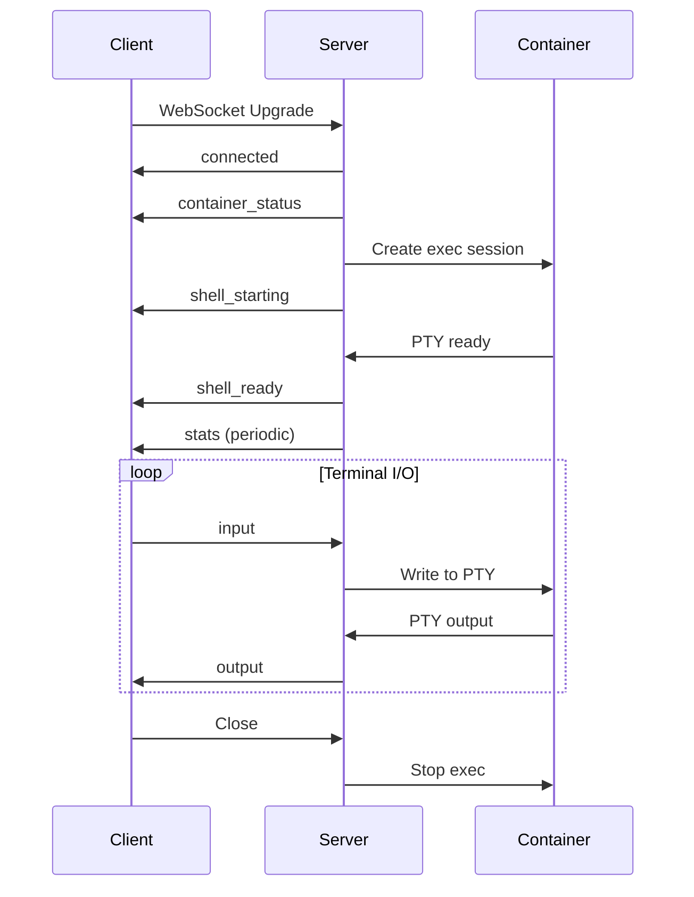

## Overview

Rexec uses WebSocket connections for real-time bidirectional communication between clients and terminal sessions. The WebSocket protocol powers:

- **Terminal Sessions**: Interactive shell access to containers
- **Agent Connections**: Remote server terminal access
- **Collaboration**: Shared terminal sessions for multiple users
- **System Monitoring**: Real-time resource statistics

## Connection Setup

### Authentication

WebSocket connections require authentication via one of these methods:

<CodeGroup>

```bash Authorization Header
wscat -c "wss://api.rexec.io/ws/terminal/:containerId" \
  -H "Authorization: Bearer YOUR_JWT_TOKEN"
```

```bash WebSocket Subprotocol
wscat -c "wss://api.rexec.io/ws/terminal/:containerId" \
  --subprotocol "rexec.v1,rexec.token.YOUR_TOKEN"
```

```bash Query Parameter
wscat -c "wss://api.rexec.io/ws/terminal/:containerId?token=YOUR_TOKEN"
```

</CodeGroup>

<Note>
  The server responds with `Sec-WebSocket-Protocol: rexec.v1` when using subprotocol authentication.
</Note>

### Connection Parameters

<ParamField query="id" type="string">
  Unique connection identifier for multiplexing (supports multiple panes per container)
</ParamField>

<ParamField query="newSession" type="boolean">
  Create a new independent shell session (for split panes)
  - `true`: Creates new tmux session with unique ID
  - `false` (default): Attaches to existing "main" session
</ParamField>

<ParamField query="token" type="string">
  Authentication token (alternative to headers)
</ParamField>

### Buffer Configuration

The WebSocket upgrader is optimized for terminal data:

- **Read Buffer**: 32 KB (supports large pastes)
- **Write Buffer**: 32 KB (handles burst output)
- **Message Size Limit**: 100 MB (for AI-assisted coding contexts)
- **Compression**: Enabled (per-message deflate)
- **Write Deadline**: 5 seconds (prevents slow client blocking)

## Message Format

All messages use JSON format with a consistent structure:

```json
{
  "type": "message_type",
  "data": "message_data",
  "cols": 80,
  "rows": 24
}
```

### Message Types

#### Client → Server Messages

<ResponseField name="input" type="object">
  Send keyboard input to the terminal
  
  ```json
  {
    "type": "input",
    "data": "ls -la\n"
  }
  ```
</ResponseField>

<ResponseField name="resize" type="object">
  Notify server of terminal size change
  
  ```json
  {
    "type": "resize",
    "cols": 120,
    "rows": 30
  }
  ```
  
  <Note>
    Terminal dimensions must be sent immediately after connection for proper rendering
  </Note>
</ResponseField>

<ResponseField name="ping" type="object">
  Keep-alive ping message
  
  ```json
  {
    "type": "ping"
  }
  ```
</ResponseField>

#### Server → Client Messages

<ResponseField name="connected" type="object">
  Sent immediately after WebSocket upgrade
  
  ```json
  {
    "type": "connected",
    "data": "Terminal session established"
  }
  ```
</ResponseField>

<ResponseField name="shell_starting" type="object">
  Shell initialization beginning
  
  ```json
  {
    "type": "shell_starting",
    "data": "Starting shell..."
  }
  ```
</ResponseField>

<ResponseField name="shell_ready" type="object">
  Shell is ready for input
  
  ```json
  {
    "type": "shell_ready",
    "data": "Shell ready"
  }
  ```
</ResponseField>

<ResponseField name="output" type="object">
  Terminal output data (including ANSI escape codes)
  
  ```json
  {
    "type": "output",
    "data": "\u001b[32muser@container\u001b[0m:~$ "
  }
  ```
  
  <Note>
    Output is UTF-8 encoded and includes ANSI color/formatting codes
  </Note>
</ResponseField>

<ResponseField name="container_status" type="object">
  Container status update
  
  ```json
  {
    "type": "container_status",
    "data": "running"
  }
  ```
  
  Status values: `configuring`, `running`, `stopped`, `removing`
</ResponseField>

<ResponseField name="stats" type="object">
  Real-time resource usage statistics
  
  ```json
  {
    "type": "stats",
    "data": {
      "cpu_percent": 15.2,
      "memory_usage": 134217728,
      "memory_limit": 536870912,
      "memory_percent": 25.0,
      "network_rx_bytes": 1024000,
      "network_tx_bytes": 512000,
      "block_read_bytes": 2048000,
      "block_write_bytes": 1024000
    }
  }
  ```
</ResponseField>

<ResponseField name="error" type="object">
  Error notification
  
  ```json
  {
    "type": "error",
    "data": "Container is no longer available"
  }
  ```
</ResponseField>

<ResponseField name="pong" type="object">
  Response to ping
  
  ```json
  {
    "type": "pong"
  }
  ```
</ResponseField>

## Connection Lifecycle

### Successful Connection Flow



### Keep-Alive Mechanism

The server sends WebSocket ping frames every 60 seconds:

- **Ping Interval**: 60 seconds
- **Pong Timeout**: 120 seconds
- **Read Deadline**: Extended on each pong

<Warning>
  Clients must respond to WebSocket ping frames or the connection will be closed after 120 seconds
</Warning>

## Advanced Features

### Terminal Multiplexing

Support for multiple terminal panes per container using tmux:

<CodeGroup>

```javascript Main Session
// Default connection - resumes "main" tmux session
const ws = new WebSocket(
  'wss://api.rexec.io/ws/terminal/abc123?id=main'
);
```

```javascript Split Pane
// Split pane - creates new independent session
const ws = new WebSocket(
  'wss://api.rexec.io/ws/terminal/abc123?id=split1&newSession=true'
);
```

</CodeGroup>

### Session Persistence

Terminal sessions use tmux for persistence:

- **Main Session**: Named `main`, persists across reconnections
- **Split Sessions**: Named `split-<timestamp>`, cleaned up on disconnect
- **Auto-restart**: Shell automatically restarts if user types `exit`
- **Reconnection**: Client can reconnect to existing session using same `id`

### Collaboration Mode

Shared terminal sessions for multiple users:

<CodeGroup>

```json View Mode
// First user creates shared session
// Subsequent users join and see output only
{
  "type": "output",
  "data": "Shared terminal output"
}
```

```json Control Mode
// Each user gets independent terminal session
// Session name: "user-<userID>"
```

</CodeGroup>

## Error Handling

### Connection Errors

<ResponseField name="401 Unauthorized" type="error">
  Invalid or missing authentication token
  
  ```json
  {
    "error": "unauthorized"
  }
  ```
</ResponseField>

<ResponseField name="403 Forbidden" type="error">
  User doesn't own the container or lacks collab access
  
  ```json
  {
    "error": "access denied"
  }
  ```
</ResponseField>

<ResponseField name="404 Not Found" type="error">
  Container doesn't exist
  
  ```json
  {
    "error": "container not found",
    "code": "container_not_found",
    "hint": "Container may need to be recreated. Try starting it.",
    "action_required": "start"
  }
  ```
</ResponseField>

<ResponseField name="423 Locked" type="error">
  Terminal is MFA protected
  
  ```json
  {
    "error": "terminal is MFA protected",
    "code": "mfa_required",
    "container_id": "abc123",
    "hint": "This terminal is protected with MFA. Enter your authenticator code to access it.",
    "action_required": "mfa_verify"
  }
  ```
</ResponseField>

### Runtime Errors

<ResponseField name="shell_error" type="object">
  Shell execution error
  
  ```json
  {
    "type": "shell_error",
    "data": "Failed to attach to terminal: container stopped"
  }
  ```
</ResponseField>

<ResponseField name="container_restart_required" type="object">
  Container was recreated with new ID
  
  ```json
  {
    "type": "container_restart_required",
    "data": "Container needs to be restarted. Please reconnect."
  }
  ```
  
  Close code: `4100` (custom code for container restart)
</ResponseField>

## Performance Optimization

### Output Coalescing

The server coalesces output for efficiency:

- **Minimum Output Size**: 1 byte (immediate send)
- **Coalesce Timeout**: 2ms (reduces small packet overhead)
- **PTY Buffer**: 64 KB (fewer syscalls)

### Compression

Per-message deflate compression is enabled:

- **Compression Level**: 6 (balance speed/size)
- **Applies to**: All text messages over 1 KB
- **Benefits**: Reduced bandwidth for large outputs

### UTF-8 Handling

Output is sanitized for valid UTF-8:

```go
// Fast path: check if already valid UTF-8
if !isValidUTF8Fast(data) {
  data = sanitizeUTF8(data)
}
```

Invalid sequences are replaced with Unicode replacement character (U+FFFD)

## Best Practices

<Note>
  **Initial Resize**: Always send terminal dimensions immediately after connection
  
  ```javascript
  ws.addEventListener('open', () => {
    ws.send(JSON.stringify({
      type: 'resize',
      cols: terminal.cols,
      rows: terminal.rows
    }));
  });
  ```
</Note>

<Warning>
  **Message Size**: While the server supports up to 100 MB messages, avoid sending extremely large inputs in a single message for better performance
</Warning>

<Note>
  **Reconnection**: Implement exponential backoff for reconnection attempts
  
  ```javascript
  let retries = 0;
  const maxRetries = 5;
  const baseDelay = 1000;
  
  function reconnect() {
    if (retries >= maxRetries) return;
    const delay = baseDelay * Math.pow(2, retries);
    setTimeout(() => {
      retries++;
      connectWebSocket();
    }, delay);
  }
  ```
</Note>

## Rate Limits

- **Concurrent Connections**: 5 per user (enforced)
- **Message Rate**: No hard limit (reasonable use expected)
- **Connection Duration**: No limit (kept alive with pings)

## See Also

- [Terminal Sessions](/api/terminal-sessions) - Detailed terminal WebSocket endpoints
- [Container API](/api/containers) - Container management operations
- [Authentication](/authentication) - Token generation and management
