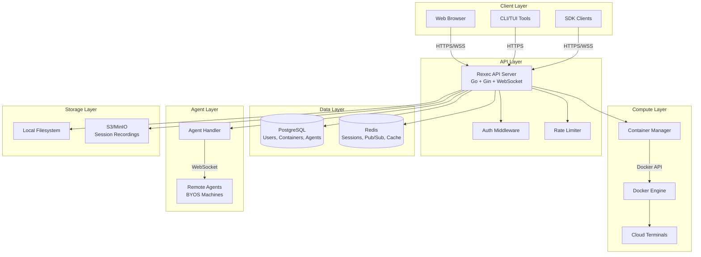
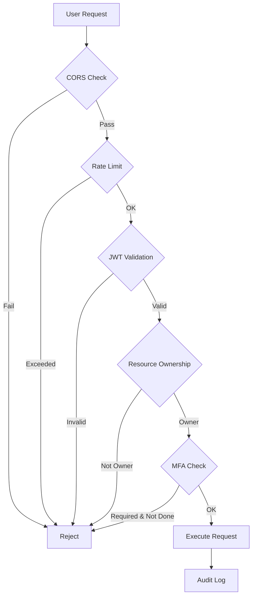
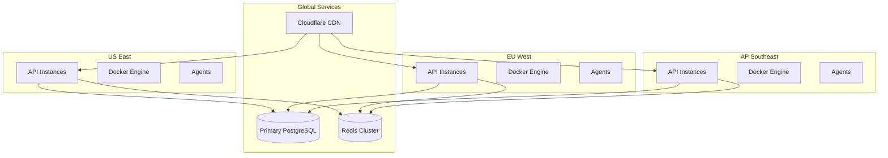

# Architecture Overview

Rexec is built with a modern, scalable architecture designed for both single-instance deployments and horizontal scaling. This guide explains how components interact and how to architect your deployment.

## System Architecture



## Core Components

<AccordionGroup>
  <Accordion title="Rexec API Server" icon="server">
    
    The backend API server is written in **Go** using the Gin web framework. It handles:
    
    **Key Responsibilities:**
    - WebSocket connections for real-time terminal streaming
    - Container lifecycle management (create, start, stop, delete)
    - Agent registration and bidirectional communication
    - Authentication, authorization, and MFA
    - Session recording and playback
    - Port forwarding and SSH key management
    - Rate limiting and security middleware
    
    **Implementation Details:**
    ```
    cmd/rexec/main.go            - Entry point and server setup
    internal/api/handlers/       - HTTP/WebSocket handlers
    internal/api/middleware/     - Auth, CORS, rate limiting
    internal/container/          - Container lifecycle management
    internal/pubsub/             - Redis pub/sub for scaling
    internal/storage/            - PostgreSQL data access
    ```
    
    **Performance:**
    - Handles 1000+ concurrent WebSocket connections per instance
    - Sub-50ms terminal input latency
    - Horizontal scaling via Redis pub/sub
    
    <Note>
      The API is stateless (except WebSocket connections) and can be load-balanced across multiple instances with Redis pub/sub.
    </Note>
    
  </Accordion>
  
  <Accordion title="Container Manager" icon="box">
    
    The Container Manager (`internal/container/manager.go`) orchestrates Docker containers for cloud terminals.
    
    **Key Features:**
    - **Lifecycle Management**: Create, start, stop, delete, and list containers
    - **Resource Limits**: Enforce CPU, memory, and disk quotas per user
    - **Network Isolation**: Containers run in isolated networks by default
    - **Auto-cleanup**: Idle containers are automatically stopped/deleted
    - **Shell Setup**: Pre-configure zsh, oh-my-zsh, and developer tools
    - **Image Management**: Pull and cache Ubuntu, Debian, Arch base images
    
    **Container Lifecycle:**
    ```mermaid
    stateDiagram-v2
        [*] --> Creating
        Creating --> Starting: Image pulled
        Starting --> Running: Container started
        Running --> Stopping: User stop / Idle timeout
        Stopping --> Stopped
        Stopped --> Starting: User restart
        Stopped --> [*]: User delete
        Running --> [*]: User delete
    ```
    
    **Resource Allocation:**
    | Resource | Default | Configurable | Notes |
    |----------|---------|--------------|-------|
    | Memory | 512 MB | ✅ | Hard limit via cgroups |
    | CPU | 0.5 cores | ✅ | CPU shares (512/1024) |
    | Disk | 1 GB | ✅ | Volume size limit |
    | Network | Isolated | ✅ | Bridge or host mode |
    
    <Warning>
      **Security**: Containers run **without** `--privileged` by default. Network isolation prevents cross-container attacks.
    </Warning>
    
  </Accordion>
  
  <Accordion title="Agent Handler" icon="network-wired">
    
    The Agent Handler (`internal/api/handlers/agent.go`) manages connections to remote Rexec Agents running on user infrastructure.
    
    **How Agents Work:**
    1. Agent installed on remote machine (laptop, server, Raspberry Pi)
    2. Agent initiates **outbound WebSocket** connection to API server
    3. API server routes user terminal connections to appropriate agent
    4. No inbound firewall rules or VPN required
    
    **Agent Communication Flow:**
    ```mermaid
    sequenceDiagram
        participant Agent as Remote Agent
        participant API as Rexec API
        participant User as Browser Client
        
        Agent->>API: WebSocket Connect (ws://host/ws/agent/:id?token=...)
        API->>Agent: Connection Accepted
        Agent->>API: System Info (CPU, RAM, OS)
        API->>Agent: Stats Request (every 5s)
        Agent->>API: Stats Response (CPU %, Memory, Disk)
        
        User->>API: Connect to Agent Terminal
        API->>Agent: shell_start
        Agent->>Agent: Spawn PTY (/bin/zsh)
        Agent->>API: shell_started
        API->>User: Terminal Ready
        
        User->>API: Terminal Input
        API->>Agent: shell_input
        Agent->>Agent: Write to PTY
        Agent->>API: shell_output
        API->>User: Terminal Output
    ```
    
    **Agent Features:**
    - **Auto-reconnect**: Exponential backoff on connection loss
    - **Multi-session**: Support split panes and multiple shells
    - **Region Detection**: Auto-detect AWS, GCP, Azure, DigitalOcean regions
    - **Distro Detection**: Identify Ubuntu, Debian, Arch, Alpine, etc.
    - **Auto-update**: Optional self-update to latest version
    
    **Agent Installation:**
    ```bash
    # One-line install
    curl -fsSL http://your-rexec.com/install-agent.sh | sudo bash -s -- --token YOUR_TOKEN
    
    # Manual installation
    wget http://your-rexec.com/downloads/rexec-agent-linux-amd64
    chmod +x rexec-agent-linux-amd64
    sudo mv rexec-agent-linux-amd64 /usr/local/bin/rexec-agent
    rexec-agent register --name "prod-server"
    sudo rexec-agent install  # Install as systemd service
    ```
    
  </Accordion>
  
  <Accordion title="PostgreSQL Database" icon="database">
    
    PostgreSQL stores all persistent data. Key tables:
    
    **Schema Overview:**
    | Table | Purpose | Key Columns |
    |-------|---------|-------------|
    | `users` | User accounts | id, email, password_hash, is_admin, mfa_enabled |
    | `containers` | Cloud terminals | id, user_id, image, status, created_at |
    | `agents` | Remote machines | id, user_id, name, type, last_seen |
    | `recordings` | Terminal sessions | id, container_id, duration, file_path |
    | `ssh_keys` | User SSH keys | id, user_id, public_key, fingerprint |
    | `api_tokens` | API access tokens | id, user_id, token_hash, expires_at |
    | `snippets` | Saved commands | id, user_id, name, command, public |
    | `audit_logs` | Security events | id, user_id, action, ip_address |
    
    **Migrations:**
    Database schema is managed via Go migrations in `internal/storage/postgres.go`. Migrations run automatically on startup.
    
    **Backup Recommendations:**
    ```bash
    # Daily automated backups
    pg_dump rexec > backup-$(date +%Y%m%d).sql
    
    # Point-in-time recovery (PITR)
    # Enable WAL archiving in postgresql.conf
    wal_level = replica
    archive_mode = on
    archive_command = 'cp %p /backups/wal/%f'
    ```
    
  </Accordion>
  
  <Accordion title="Redis (Optional but Recommended)" icon="bolt">
    
    Redis provides caching, session management, and pub/sub for horizontal scaling.
    
    **Use Cases:**
    
    1. **Session Management**
       - Store JWT session metadata
       - Track active WebSocket connections
       - Manage rate limit counters
    
    2. **Pub/Sub for Scaling**
       - Broadcast terminal events across multiple API instances
       - Route agent connections to correct API instance
       - Synchronize container state updates
    
    3. **Caching**
       - Cache user profiles and permissions
       - Store Docker image metadata
       - Cache SSH key lookups
    
    **Multi-Instance Deployment:**
    ```mermaid
    graph LR
        LB[Load Balancer] --> API1[API Instance 1]
        LB --> API2[API Instance 2]
        LB --> API3[API Instance 3]
        API1 --> Redis
        API2 --> Redis
        API3 --> Redis
        Redis --> |Pub/Sub| API1
        Redis --> |Pub/Sub| API2
        Redis --> |Pub/Sub| API3
    ```
    
    <Note>
      Without Redis, Rexec runs in **single-instance mode**. This is fine for small deployments but limits scalability.
    </Note>
    
  </Accordion>
  
  <Accordion title="Frontend (Svelte)" icon="browser">
    
    The web UI is built with **Svelte**, **xterm.js**, and **Tailwind CSS**.
    
    **Key Features:**
    - Real-time terminal with xterm.js
    - WebSocket connection management
    - Container lifecycle controls (start, stop, delete)
    - File upload/download via WebRTC
    - Collaborative terminal sharing
    - Session recording playback
    - Dark/light theme support
    - PWA with offline support
    
    **Build Output:**
    ```
    frontend/               - Source code
    ├── src/
    │   ├── lib/
    │   │   ├── components/   - Svelte components
    │   │   ├── stores/       - State management
    │   │   └── api.ts        - API client
    │   └── App.svelte        - Root component
    ├── package.json
    └── vite.config.ts
    
    web/                    - Compiled static assets (served by API)
    ├── assets/             - JS/CSS bundles
    ├── index.html          - SPA entry point
    └── favicon.svg
    ```
    
    **Build Process:**
    ```bash
    cd frontend
    npm install
    npm run build  # Output to ../web/
    ```
    
    The API server (`cmd/rexec/main.go`) serves these static files from the `web/` directory.
    
  </Accordion>
</AccordionGroup>

## Data Flow

### Terminal Connection Flow

<Steps>
  <Step title="User Opens Terminal">
    Browser sends WebSocket upgrade request:
    ```
    GET /ws/terminal/:containerId
    Upgrade: websocket
    Authorization: Bearer <jwt_token>
    ```
  </Step>
  
  <Step title="Authentication & Authorization">
    API validates JWT, checks if user owns the container, and upgrades connection to WebSocket.
  </Step>
  
  <Step title="Terminal Initialization">
    - API spawns PTY in container (or connects to agent)
    - Sets terminal size (cols/rows from client)
    - Starts bidirectional streaming
  </Step>
  
  <Step title="Real-Time Streaming">
    ```mermaid
    sequenceDiagram
        participant Browser
        participant API
        participant Container
        
        Browser->>API: Input: "ls -la\n"
        API->>Container: Write to PTY stdin
        Container->>Container: Execute command
        Container->>API: Output: "total 48\ndrwxr-xr-x..."
        API->>Browser: Stream output
        Browser->>Browser: Render in xterm.js
    ```
    Latency: **less than 50ms** on local network, **100-200ms** on WAN
  </Step>
  
  <Step title="Terminal Resize">
    Browser detects window resize, sends new dimensions:
    ```json
    {"type": "resize", "cols": 120, "rows": 40}
    ```
    API updates PTY size via `pty.Setsize()`.
  </Step>
  
  <Step title="Connection Close">
    - WebSocket disconnects (user closes tab or network drop)
    - Container keeps running (session persistence)
    - User can reconnect and resume
  </Step>
</Steps>

### Agent Connection Flow

<CodeGroup>

```go Agent Connection (Server Side)
// internal/api/handlers/agent.go
func (h *AgentHandler) HandleAgentWebSocket(c *gin.Context) {
    agentID := c.Param("id")
    token := c.Query("token")
    
    // Validate agent token
    agent, err := h.store.ValidateAgentToken(ctx, agentID, token)
    if err != nil {
        c.JSON(401, gin.H{"error": "unauthorized"})
        return
    }
    
    // Upgrade to WebSocket
    conn, err := upgrader.Upgrade(c.Writer, c.Request, nil)
    if err != nil {
        return
    }
    defer conn.Close()
    
    // Register agent connection
    h.registerAgent(agentID, conn)
    defer h.unregisterAgent(agentID)
    
    // Handle bidirectional messages
    for {
        var msg AgentMessage
        if err := conn.ReadJSON(&msg); err != nil {
            break
        }
        h.handleAgentMessage(agentID, msg)
    }
}
```

```go Agent Connection (Agent Side)
// cmd/rexec-agent/main.go
func (a *Agent) connect() error {
    wsURL := fmt.Sprintf("%s/ws/agent/%s?token=%s",
        a.config.Host, a.config.ID, a.config.Token)
    
    conn, _, err := websocket.DefaultDialer.Dial(wsURL, http.Header{
        "X-Agent-Name":   []string{a.config.Name},
        "X-Agent-OS":     []string{runtime.GOOS},
        "X-Agent-Arch":   []string{runtime.GOARCH},
        "X-Agent-Shell":  []string{a.config.Shell},
    })
    if err != nil {
        return err
    }
    
    a.conn = conn
    a.sendSystemInfo()      // Send CPU, RAM, disk stats
    go a.reportStats()      // Send updates every 5s
    return nil
}
```

</CodeGroup>

## Security Architecture

<CardGroup cols={2}>
  <Card title="Authentication" icon="key">
    - **JWT tokens** for API authentication
    - **MFA (TOTP)** with backup codes
    - **API tokens** for CLI/agent access
    - **OAuth** integration (PipeOps)
  </Card>
  <Card title="Authorization" icon="shield-halved">
    - Role-based access control (user/admin)
    - Per-resource ownership checks
    - Rate limiting per user/IP
    - Audit logging for all actions
  </Card>
  <Card title="Network Isolation" icon="network-wired">
    - Containers in isolated bridge networks
    - No internet access by default
    - Port forwarding via secure WebSocket
    - SSH gateway with key-based auth
  </Card>
  <Card title="Data Protection" icon="lock">
    - Sensitive data encrypted at rest (AES-256-GCM)
    - Passwords hashed with bcrypt
    - TLS for all external connections
    - Session recordings stored encrypted
  </Card>
</CardGroup>

### Security Layers



<Warning>
  **Production Security Checklist:**
  - Change default admin password
  - Use strong JWT and encryption secrets (32+ characters)
  - Enable HTTPS/TLS (reverse proxy with Let's Encrypt)
  - Set `ALLOWED_ORIGINS` to your domain only
  - Enable MFA for admin accounts
  - Configure firewall rules (only expose ports 80/443)
  - Set up regular PostgreSQL backups
  - Monitor audit logs for suspicious activity
</Warning>

## Scaling Strategies

### Single-Instance Deployment

For **fewer than 100 users** or **fewer than 500 containers**:

```yaml
# docker-compose.yml
services:
  rexec:
    image: rexec:latest
    ports:
      - "8080:8080"
    environment:
      - PORT=8080
      - DATABASE_URL=postgres://...
      # No REDIS_URL = single-instance mode
    deploy:
      resources:
        limits:
          cpus: '4'
          memory: 8G
```

**Capacity:**
- 1000+ concurrent WebSocket connections
- 500+ active containers
- 50+ agents

### Multi-Instance Deployment (Horizontal Scaling)

For **>100 users** or **>500 containers**:

```yaml
# docker-compose.yml
services:
  rexec:
    image: rexec:latest
    deploy:
      replicas: 3  # Scale to 3 instances
    environment:
      - PORT=8080
      - DATABASE_URL=postgres://...
      - REDIS_URL=redis://redis:6379  # REQUIRED for scaling
    
  nginx:
    image: nginx:alpine
    ports:
      - "80:80"
      - "443:443"
    volumes:
      - ./nginx.conf:/etc/nginx/nginx.conf
    depends_on:
      - rexec
  
  redis:
    image: redis:7-alpine
    volumes:
      - redis-data:/data
  
  postgres:
    image: postgres:16-alpine
    volumes:
      - postgres-data:/var/lib/postgresql/data
```

**Nginx Configuration (WebSocket Support):**
```nginx
upstream rexec_backend {
    least_conn;  # Balance by connection count
    server rexec:8080;
}

server {
    listen 80;
    server_name rexec.example.com;
    
    location / {
        proxy_pass http://rexec_backend;
        proxy_http_version 1.1;
        proxy_set_header Upgrade $http_upgrade;
        proxy_set_header Connection "upgrade";
        proxy_set_header Host $host;
        proxy_set_header X-Real-IP $remote_addr;
        proxy_set_header X-Forwarded-For $proxy_add_x_forwarded_for;
        proxy_set_header X-Forwarded-Proto $scheme;
        
        # WebSocket timeouts
        proxy_read_timeout 3600s;
        proxy_send_timeout 3600s;
    }
}
```

### Multi-Region Deployment

For **global users** with **multiple Docker hosts**:



## Performance Optimization

<CardGroup cols={2}>
  <Card title="Database Optimization" icon="database">
    - Index frequently queried columns (user_id, container_id)
    - Use connection pooling (default: 25 connections)
    - Enable query caching for read-heavy tables
    - Partition large tables (audit_logs, recordings)
  </Card>
  <Card title="Redis Caching" icon="bolt">
    - Cache user profiles (5min TTL)
    - Cache Docker image metadata (1hr TTL)
    - Cache SSH keys (10min TTL)
    - Use Redis Cluster for >10GB cache
  </Card>
  <Card title="Container Performance" icon="box">
    - Pre-pull base images on startup
    - Use overlay2 storage driver
    - Set memory swappiness to 0
    - Use host networking for low-latency
  </Card>
  <Card title="WebSocket Optimization" icon="network-wired">
    - Enable compression for large outputs
    - Use binary WebSocket frames (MessagePack)
    - Set read/write deadlines (30s)
    - Implement backpressure handling
  </Card>
</CardGroup>

## Monitoring & Observability

<Tabs>
  <Tab title="Health Checks">
    ```bash
    # API health
    curl http://localhost:8080/health
    
    # Expected response:
    {
      "status": "ok",
      "database": "connected",
      "docker": "connected",
      "containers_total": 42,
      "containers_running": 15
    }
    ```
  </Tab>
  
  <Tab title="Metrics (Prometheus)">
    ```yaml
    # prometheus.yml
    scrape_configs:
      - job_name: 'rexec'
        static_configs:
          - targets: ['rexec:6060']
    ```
    
    Enable pprof in `.env`:
    ```bash
    REXEC_PPROF=true
    REXEC_PPROF_ADDR=0.0.0.0:6060
    ```
  </Tab>
  
  <Tab title="Logs">
    ```bash
    # Docker Compose logs
    docker compose logs -f rexec
    
    # Filter by level
    docker compose logs rexec | grep ERROR
    
    # Export to file
    docker compose logs rexec > rexec.log
    ```
    
    Set log level in `.env`:
    ```bash
    LOG_LEVEL=debug  # debug, info, warn, error
    ```
  </Tab>
</Tabs>

## Next Steps

<CardGroup cols={2}>
  <Card title="Deploy to Production" icon="rocket" href="/deployment">
    Learn about SSL/TLS, reverse proxies, backups, and monitoring
  </Card>
  <Card title="Install Agents" icon="server" href="/agent">
    Connect your servers to Rexec for unified remote access
  </Card>
  <Card title="API Integration" icon="code" href="/sdk">
    Build terminals into your app with our SDKs
  </Card>
  <Card title="Security Best Practices" icon="shield" href="/security">
    Harden your deployment with our security guide
  </Card>
</CardGroup>