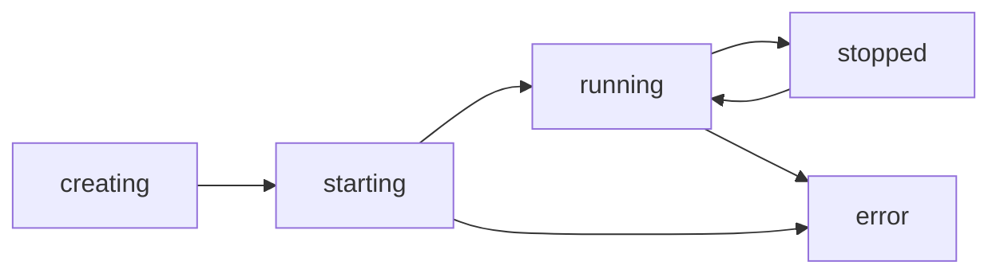

## Overview

Rexec containers are isolated Linux environments powered by Docker. Each container provides a full shell with persistent storage, customizable resources, and support for 60+ Linux distributions.

---

## Creating Containers

### Quick Create

Create a container with default settings:

```bash
curl -X POST https://rexec.pipeops.io/api/containers \
  -H "Authorization: Bearer <token>" \
  -H "Content-Type: application/json" \
  -d '{"image": "ubuntu"}'
```

Response:
```json
{
  "id": "container-abc123",
  "name": "swift-fox-42",
  "image": "ubuntu:24.04",
  "status": "creating",
  "async": true,
  "message": "Container is being created. This may take a moment if the image needs to be pulled.",
  "resources": {
    "memory_mb": 2048,
    "cpu_shares": 1000,
    "disk_mb": 8192
  }
}
```

<Note>
  Container creation is asynchronous to avoid timeouts. Monitor progress via WebSocket events or poll the container status endpoint.
</Note>

### Container Creation Flow

Here's what happens when you create a container:

<Steps>
  <Step title="Validation">
    Rexec validates your request and checks container limits:

    ```go
    // Check container limit
    existingContainers, _ := h.store.GetContainersByUserID(ctx, userID)
    currentCount := len(existingContainers)
    limit := container.UserContainerLimit(tier)
    if currentCount >= limit {
        return error("container limit reached")
    }
    ```
  </Step>

  <Step title="Image Pull">
    The Docker image is pulled if not already cached:

    ```go
    // Pull image if needed
    if imageType == "custom" {
        pullErr = h.manager.PullCustomImage(ctx, customImage)
    } else {
        pullErr = h.manager.PullImage(ctx, imageType)
    }
    ```
  </Step>

  <Step title="Container Creation">
    A Docker container is created with resource limits:

    ```go
    hostConfig := &container.HostConfig{
        Resources: container.Resources{
            Memory:     cfg.MemoryLimit,
            MemorySwap: cfg.MemoryLimit,
            CPUPeriod:  100000,
            CPUQuota:   (cfg.CPULimit * 100000) / 1000,
            PidsLimit:  &[]int64{512}[0],
        },
        StorageOpt: map[string]string{
            "size": formatBytes(cfg.DiskQuota),
        },
    }
    ```
  </Step>

  <Step title="Shell Setup">
    Enhanced shell features are configured (zsh, plugins, themes):

    ```go
    go func(containerID string) {
        shellCtx, _ := context.WithTimeout(bgCtx, 5*time.Minute)
        shellResult, _ := container.SetupShellWithConfig(shellCtx, h.manager.GetClient(), containerID, shellCfg)
        log.Printf("Shell setup complete for %s", containerID[:12])
    }(info.ID)
    ```
  </Step>
</Steps>

### Available Images

Rexec supports 60+ Linux distributions:

<Tabs>
  <Tab title="Popular">
    - `ubuntu` - Ubuntu 24.04 LTS
    - `debian` - Debian 12 Bookworm
    - `alpine` - Alpine Linux 3.21
    - `fedora` - Fedora 41
    - `archlinux` - Arch Linux
    - `kali` - Kali Linux
  </Tab>

  <Tab title="Debian-based">
    - `ubuntu-24`, `ubuntu-22`, `ubuntu-20`
    - `debian-12`, `debian-11`
    - `mint` - Linux Mint 22
    - `kali` - Kali Linux
    - `parrot` - Parrot OS
  </Tab>

  <Tab title="Red Hat-based">
    - `fedora-41`, `fedora-40`, `fedora-39`
    - `centos` - CentOS Stream 9
    - `rocky` - Rocky Linux 9
    - `alma` - AlmaLinux 9
    - `rhel` - Red Hat UBI 9
  </Tab>

  <Tab title="Other">
    - `alpine` - Alpine Linux
    - `archlinux` - Arch Linux
    - `opensuse` - openSUSE Leap
    - `gentoo` - Gentoo Linux
    - `nixos` - NixOS
    - `void` - Void Linux
  </Tab>
</Tabs>

### Custom Images

Use any public Docker image:

```bash
curl -X POST https://rexec.pipeops.io/api/containers \
  -H "Authorization: Bearer <token>" \
  -H "Content-Type: application/json" \
  -d '{
    "image": "custom",
    "custom_image": "node:20-alpine",
    "name": "my-node-env"
  }'
```

---

## Container Configuration

### Resource Limits

Configure CPU, memory, and disk limits:

```bash
curl -X POST https://rexec.pipeops.io/api/containers \
  -H "Authorization: Bearer <token>" \
  -H "Content-Type: application/json" \
  -d '{
    "image": "ubuntu",
    "name": "high-memory-container",
    "memory_mb": 4096,
    "cpu_shares": 2000,
    "disk_mb": 16384
  }'
```

#### Resource Limits by Tier

| Tier | Memory | CPU | Disk |
|------|--------|-----|------|
| Guest | 512MB - 2GB | 0.5 - 1 vCPU | 2GB - 8GB |
| Free | 512MB - 2GB | 0.5 - 2 vCPU | 2GB - 8GB |
| Pro | 512MB - 4GB | 0.5 - 4 vCPU | 2GB - 16GB |
| Enterprise | 512MB - 8GB | 0.5 - 8 vCPU | 2GB - 32GB |

<Warning>
  Resource limits are enforced at the Docker level. Containers exceeding memory limits will be OOM-killed.
</Warning>

### Role-Based Setup

Rexec can pre-install tools for specific use cases:

<CodeGroup>
```bash Node.js Environment
curl -X POST https://rexec.pipeops.io/api/containers \
  -H "Authorization: Bearer <token>" \
  -d '{"image": "ubuntu", "role": "node"}'
```

```bash Python Environment
curl -X POST https://rexec.pipeops.io/api/containers \
  -H "Authorization: Bearer <token>" \
  -d '{"image": "ubuntu", "role": "python"}'
```

```bash Rust Environment
curl -X POST https://rexec.pipeops.io/api/containers \
  -H "Authorization: Bearer <token>" \
  -d '{"image": "ubuntu", "role": "rust"}'
```
</CodeGroup>

#### Available Roles

- `node` - Node.js, npm, yarn
- `python` - Python 3, pip, venv
- `go` - Go compiler and tools
- `rust` - Rust, cargo
- `java` - OpenJDK, Maven
- `dotnet` - .NET SDK
- `php` - PHP, Composer
- `ruby` - Ruby, bundler

### Shell Configuration

Customize the shell experience:

```bash
curl -X POST https://rexec.pipeops.io/api/containers \
  -H "Authorization: Bearer <token>" \
  -H "Content-Type: application/json" \
  -d '{
    "image": "ubuntu",
    "shell": {
      "enhanced": true,
      "theme": "agnoster",
      "autosuggestions": true,
      "syntax_highlight": true,
      "git_aliases": true,
      "use_tmux": true
    }
  }'
```

This installs:
- Zsh with Oh My Zsh
- Powerlevel10k theme
- zsh-autosuggestions
- zsh-syntax-highlighting
- Common git aliases
- tmux for session persistence

---

## Managing Containers

### List Containers

```bash
curl https://rexec.pipeops.io/api/containers \
  -H "Authorization: Bearer <token>"
```

Response:
```json
{
  "containers": [
    {
      "id": "container-abc123",
      "name": "swift-fox-42",
      "image": "ubuntu:24.04",
      "role": "python",
      "status": "running",
      "created_at": "2024-01-15T10:30:00Z",
      "last_used_at": "2024-01-15T12:45:00Z",
      "idle_seconds": 120,
      "resources": {
        "memory_mb": 2048,
        "cpu_shares": 1000,
        "disk_mb": 8192
      }
    }
  ],
  "count": 1,
  "limit": 5
}
```

### Get Container Details

```bash
curl https://rexec.pipeops.io/api/containers/<container-id> \
  -H "Authorization: Bearer <token>"
```

### Start Container

```bash
curl -X POST https://rexec.pipeops.io/api/containers/<container-id>/start \
  -H "Authorization: Bearer <token>"
```

### Stop Container

```bash
curl -X POST https://rexec.pipeops.io/api/containers/<container-id>/stop \
  -H "Authorization: Bearer <token>"
```

### Delete Container

```bash
curl -X DELETE https://rexec.pipeops.io/api/containers/<container-id> \
  -H "Authorization: Bearer <token>"
```

<Warning>
  Deleting a container also deletes its persistent volume and all data. This action cannot be undone.
</Warning>

---

## Container Lifecycle

### Container States



- **creating** - Image is being pulled and container is being set up
- **starting** - Container is starting up
- **running** - Container is ready and accepting connections
- **stopped** - Container is stopped but not deleted
- **error** - Container creation or startup failed

### Auto-Start on Connect

Stopped containers automatically start when you connect to them:

```go
func (h *ContainerHandler) Start(c *gin.Context) {
    dockerID := c.Param("id")

    // Check if container exists in Docker
    containerExistsInDocker := h.manager.DockerContainerExists(ctx, dockerID)

    if !containerExistsInDocker {
        // Container was removed from Docker - recreate it
        newInfo, err := h.manager.RecreateContainer(ctx, recreateCfg)
        h.store.UpdateContainerDockerID(ctx, found.ID, newInfo.ID)
        return
    }

    // Start normally
    h.manager.StartContainer(ctx, dockerID)
}
```

---

## Persistent Storage

Each container has a persistent volume mounted at `/home/user`:

```go
hostConfig.Mounts = []mount.Mount{
    {
        Type:   mount.TypeVolume,
        Source: volumeName,  // rexec-{userID}-{containerName}
        Target: "/home/user",
    },
}
```

Data in `/home/user` persists across:
- Container restarts
- Container stops/starts
- Server restarts

Data is only deleted when you delete the container.

### Disk Quotas

Rexec enforces disk quotas using Docker's `storage-opt`:

```go
if m.IsDiskQuotaEnabled() && cfg.DiskQuota > 0 {
    storageOpts["size"] = formatBytes(cfg.DiskQuota)
}
```

This requires:
- Docker storage driver: `overlay2`
- Backing filesystem: XFS with `pquota` mount option

<Note>
  Disk quotas may not be available on all Docker hosts. Check your hosting provider's documentation.
</Note>

---

## Container Isolation

### Network Isolation

Containers are connected to an isolated network with inter-container communication (ICC) disabled:

```go
func (m *Manager) ensureIsolatedNetwork() error {
    _, err = m.client.NetworkCreate(ctx, "rexec-isolated", network.CreateOptions{
        Driver: "bridge",
        Options: map[string]string{
            "com.docker.network.bridge.enable_icc": "false",
        },
    })
    return err
}
```

### Security Hardening

Containers run with strict security settings:

```go
hostConfig := &container.HostConfig{
    SecurityOpt: []string{
        "no-new-privileges:true",
    },
    CapDrop: []string{"ALL"},
    CapAdd: []string{
        "CHOWN", "DAC_OVERRIDE", "FOWNER",
        "SETGID", "SETUID", "KILL",
        "NET_BIND_SERVICE", "SYS_PTRACE",
    },
    MaskedPaths: []string{
        "/proc/acpi", "/proc/kcore", "/proc/keys",
        "/sys/firmware", "/sys/kernel",
    },
}
```

### OCI Runtime Options

Choose your container runtime:

```bash
# Default: runc (maximum compatibility)
export OCI_RUNTIME=runc

# gVisor: Enhanced isolation
export OCI_RUNTIME=runsc

# Kata Containers: VM-level isolation
export OCI_RUNTIME=kata
```

---

## Monitoring Containers

### Container Stats

Get real-time resource usage:

```bash
curl https://rexec.pipeops.io/api/containers/<container-id>/stats \
  -H "Authorization: Bearer <token>"
```

Response:
```json
{
  "cpu_percent": 12.5,
  "memory_usage": 524288000,
  "memory_limit": 2147483648,
  "memory_percent": 24.4,
  "net_rx_bytes": 1024000,
  "net_tx_bytes": 512000
}
```

### WebSocket Stats Stream

Subscribe to real-time stats updates:

```javascript
const ws = new WebSocket('wss://rexec.pipeops.io/ws/stats/<container-id>?token=<token>');

ws.onmessage = (event) => {
  const stats = JSON.parse(event.data);
  console.log(`CPU: ${stats.cpu_percent}%`);
  console.log(`Memory: ${stats.memory_percent}%`);
};
```

---

## Container Limits

### Limits by Tier

| Tier | Max Containers |
|------|----------------|
| Guest | 5 |
| Free | 5 |
| Pro | 20 |
| Enterprise | Unlimited |

### Idle Timeout

Containers are automatically stopped after 24 hours of inactivity (no terminal connections or API calls).

Guest containers are deleted after 50 hours.

---

## Advanced Features

### macOS Containers (Enterprise)

Rexec supports macOS containers using `docker-osx`:

```bash
curl -X POST https://rexec.pipeops.io/api/containers \
  -H "Authorization: Bearer <token>" \
  -H "Content-Type: application/json" \
  -d '{
    "image": "macos",
    "memory_mb": 4096,
    "cpu_shares": 2000,
    "disk_mb": 20480
  }'
```

<Warning>
  macOS containers require:
  - Enterprise tier or admin access
  - Minimum 4GB RAM, 2 vCPU, 20GB disk
  - KVM support (`/dev/kvm`)
</Warning>

### Container Recreation

If a container is removed from Docker but exists in the database, Rexec can recreate it:

```go
func (m *Manager) RecreateContainer(ctx context.Context, cfg RecreateContainerConfig) (*ContainerInfo, error) {
    // Create new container with same config
    newInfo, err := m.CreateContainer(ctx, ContainerConfig{
        UserID:        cfg.UserID,
        ContainerName: cfg.ContainerName,
        ImageType:     cfg.Image,
        MemoryLimit:   cfg.MemoryMB * 1024 * 1024,
        CPULimit:      cfg.CPUMillicores,
        DiskQuota:     cfg.DiskMB * 1024 * 1024,
    })
    return newInfo, err
}
```

The persistent volume is reattached, preserving user data.

---

## Next Steps

<CardGroup cols={2}>
  <Card title="File Operations" icon="file" href="/guides/file-operations">
    Upload and download files to containers
  </Card>
  <Card title="Terminal Access" icon="terminal" href="/guides/embedding">
    Connect to containers via web terminal
  </Card>
  <Card title="SDK Reference" icon="code" href="/sdk/overview">
    Manage containers programmatically
  </Card>
  <Card title="API Reference" icon="book" href="/api-reference/containers">
    Complete container API documentation
  </Card>
</CardGroup>