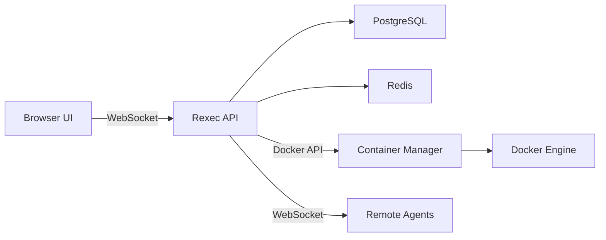

# Welcome to Rexec

Rexec is an open-source platform that gives you **instantly-available, network-isolated Linux terminals in the cloud**, or lets you **connect your own machines** to a unified dashboard. Built for developers who need on-demand environments and secure remote access.

<CardGroup cols={2}>
  <Card title="Quick Start" icon="rocket" href="/quickstart">
    Get Rexec running with Docker Compose in under 2 minutes
  </Card>
  <Card title="Architecture" icon="diagram-project" href="/architecture">
    Understand how Rexec components work together
  </Card>
  <Card title="Connect Agents" icon="server" href="/agent">
    Install the agent on your servers to access them via Rexec
  </Card>
  <Card title="API Reference" icon="code" href="/api-reference">
    Integrate Rexec into your applications with our SDKs
  </Card>
</CardGroup>

## Key Features

<CardGroup cols={3}>
  <Card title="Instant Cloud Terminals" icon="terminal">
    Create, start, and destroy disposable Linux sandboxes in seconds, powered by Docker
  </Card>
  <Card title="Connect Any Machine (BYOS)" icon="network-wired">
    Install the lightweight Rexec Agent on your laptop, server, or Raspberry Pi to access it securely from the browser without VPNs or SSH port exposure
  </Card>
  <Card title="First-Class Terminal UX" icon="window-maximize">
    Real-time WebSocket streaming with xterm.js, JetBrains Mono fonts, and a native-feeling UI
  </Card>
  <Card title="Secure by Default" icon="shield-halved">
    JWT authentication, MFA support, audit logging, and isolated container networking
  </Card>
  <Card title="Collaboration" icon="users">
    Share terminal sessions for pair programming or debugging with real-time collaboration
  </Card>
  <Card title="Session Recording" icon="video">
    Record and replay terminal sessions for documentation or audit trails
  </Card>
</CardGroup>

## How It Works

Rexec provides two primary modes of operation:

### Cloud Terminals

Spin up ephemeral Docker containers on-demand. Perfect for:
- Development environments
- CI/CD runners
- Coding interviews
- Interactive tutorials
- AI agent execution sandboxes

```bash
# Create a new Ubuntu terminal
curl -X POST http://localhost:8080/api/containers \
  -H "Authorization: Bearer $TOKEN" \
  -d '{"image": "ubuntu:24.04", "name": "dev-env"}'
```

### Remote Agents (BYOS)

Connect your own infrastructure using the Rexec Agent. The agent establishes a secure outbound WebSocket connection to your Rexec server - no firewall changes or inbound ports required.

```bash
# Install agent on any Linux machine
curl -fsSL http://localhost:8080/install-agent.sh | sudo bash -s -- --token YOUR_TOKEN
```

<Note>
  Agents work on laptops, VMs, Raspberry Pis, edge devices, and production servers. Access everything through one unified interface.
</Note>

## Architecture Overview

Rexec consists of four main components:



<CardGroup cols={2}>
  <Card title="Frontend" icon="browser">
    **Svelte** + xterm.js + Tailwind CSS
    
    Progressive web app with offline support, real-time terminal streaming, and collaborative editing
  </Card>
  <Card title="Backend" icon="server">
    **Go** (Gin framework) + Gorilla WebSocket
    
    High-performance API server handling WebSocket connections, container lifecycle, and agent communication
  </Card>
  <Card title="Database" icon="database">
    **PostgreSQL** for persistent data
    
    Stores users, containers, agents, recordings, snippets, and audit logs
  </Card>
  <Card title="Cache & Pub/Sub" icon="bolt">
    **Redis** for horizontal scaling
    
    Session management, WebSocket pub/sub for multi-instance deployments, and caching
  </Card>
</CardGroup>

## Use Cases

<AccordionGroup>
  <Accordion title="Ephemeral Development Environments">
    Spin up a fresh, clean environment for every task, PR, or experiment. Ephemeral environments eliminate configuration drift, dependency conflicts, and the "works on my machine" syndrome.
  </Accordion>
  
  <Accordion title="Collaborative Intelligence (AI Agents)">
    Let LLMs and AI agents execute code in a real, safe environment while you supervise. Rexec provides the perfect sandbox for autonomous agents to work alongside humans.
  </Accordion>
  
  <Accordion title="Secure Remote Access">
    Replace complex VPNs and bastion hosts. Rexec provides a secure, audited gateway to your private infrastructure with MFA, IP restrictions, and full command logging.
  </Accordion>
  
  <Accordion title="Technical Interviews & Onboarding">
    Conduct real-time coding interviews in a real Linux environment. Provide pre-configured environments for workshops, tutorials, and new hire onboarding with zero setup friction.
  </Accordion>
  
  <Accordion title="Hybrid Infrastructure Access">
    Seamlessly switch between Rexec's cloud terminals and your on-premise servers without changing tools or context. One dashboard for everything.
  </Accordion>
</AccordionGroup>

## What's Next?

<CardGroup cols={2}>
  <Card title="Deploy with Docker" icon="docker" href="/quickstart">
    Follow our quickstart guide to get Rexec running locally in minutes
  </Card>
  <Card title="Explore the Architecture" icon="sitemap" href="/architecture">
    Learn how components interact and how to scale Rexec
  </Card>
  <Card title="Install the Agent" icon="download" href="/agent">
    Connect your servers to Rexec for unified remote access
  </Card>
  <Card title="Build with SDKs" icon="code" href="/sdk">
    Integrate terminals into your application with Go, TypeScript, Python, or Rust SDKs
  </Card>
</CardGroup>

<Note>
  **Open Source**: Rexec is MIT licensed. Contributions welcome at [github.com/PipeOpsHQ/rexec](https://github.com/PipeOpsHQ/rexec)
</Note>